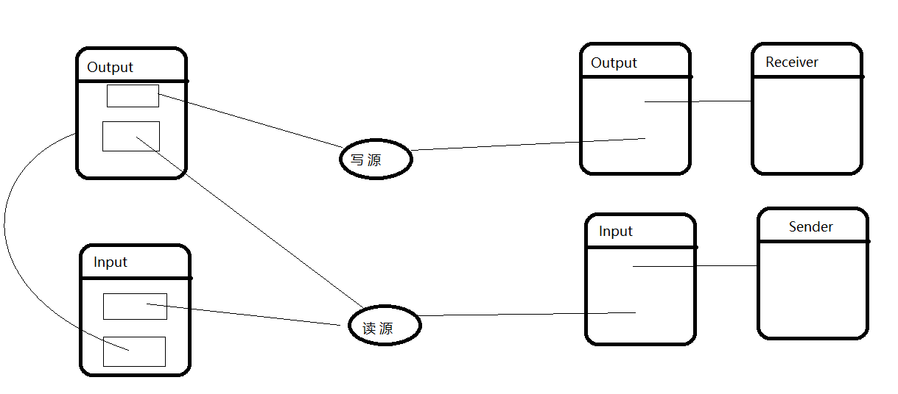

# Java 通用 I/O API 设计与分析
这篇文章其实算[Java的通用IO API设计](https://github.com/oldratlee/io-api)半个家庭作业

## 介绍

无意间看了[哲良](https://github.com/oldratlee)的GitHub，发现了一个有趣的repo。名字就是这个，JAVA通用
IO API的设计。最初以为是关于磁盘IO操作的API设计，因为最近正好再学习这方面的内容。深入看后发现是Input/Output
的API设计，看似简单，但内涵哲学。所以模仿哲良大大先看了原版的文章，然后动手实现一个自己的I/O API。

## 理解

### 何为I/O

简单说下自己的理解吧，从函数(方法)的本质来说，其实就是由一个(或者多个)Input和一个(或多个)Output组成，形象点
比喻的话：就是*你往电饭锅里放了一些米和水，然后按上煮饭按钮，过一段时间就能煮出米饭。* 这里，水和米就是输入(Input),
米饭就是输出(Output),煮饭按钮就是函数调用，等待的时间就是函数执行的时间。

虽然电饭煲是一个高度集成的物品，和我们的API设计初衷不太一样(我们目的是I/O分离)，但是还是很好的诠释了什么是I/O。

### 哪里会用到I/O

我理解的I/O范围有点广泛，这里主要考虑的还是数据的转移，比如说从A文件到B文件(文章里主要也是用的这个例子)，从
String格式到JsonObject。。。

我觉得，在实际的开发中，可能会在下面几个场景用到：

- request的parameter到具体的Vo
- 存储上传来的文件
- 原始的Vo验证和格式转换为对应数据库实体的model
- 数据库查询的model到返回的response
- 时间戳到各种时间格式的转换(我也不清楚有没有这个，大部分情况直接用date的API就行了)
- 自己开发一些库(比如sql查询？输入是String类型的sql，输出是具体的model？)


### 接口简单的分析

文章先是根据一个简单Java文件拷贝操作，分析了它的一些通用的步骤，然后把这些步骤抽象成
四个接口和四个方法(就是不贴原文，你们自己看去)

- Input::transferTo
- Output::receiveFrom
- Sender::sendTo
- Receiver::receive

下面我详细分析下这四个接口和方法,先说下用法

最简单的调用可能是这样：
```
    Input in = .....
    Output out = .....
    in.transferTo(out);
```
对比下平常我们是怎么拷贝文件的，是不是看起来更清晰了？

最外层：Input对象调用transferTo,传入Output对象，*语义上*看，就是最直观的转换。

transferTo方法：
```
    output.receiveForm(sender);
```
output对象调用receiveForm，表示从sender中接收数据

receiveForm方法:

```
    sender.sendTo(receiver);
```
这个和上面的input差不多，就是将sender的数据发送给receiver

sendTo方法:
```
    receiver.receive(item);
```
这里我觉得是元数据转换的地方，也就是实际操作发生的地方，在文件操作中，
这里就是实现A文件拷贝到B文件的地方(按行操作，每一行则为元数据)。

### 对接口设计的理解

在原文中，作者把一个简单的文件操作抽象成了4部分
1. 初始化输入和输出
2. 从输入中读数据
3. 辅助代码，记录或者验证一些东西，可重用
4. 向输出里写

但是经过我反复阅读，以及自己动手后，我觉得应该是这样
1. 将输入/输出源 转换为可顺序读写的对象。 也就是对应Input/Output 接口
2. 从对象中读取数据。 Sender接口
3. 辅助代码。 Filter
4. 向输出里写。 Receiver接口

每一个接口都有他独立的职责，这也隐合了单一职责原则的开发思想，其次就是把一个复杂的操作，分解成了几个单独的步骤，
又通过组合将其拼装起来，其粒度更细，更容易在各个节点接管操作(这就是文中所说的，第三步的filter可以复用)，最后，
形成一个固定的流程，可读性大大增强。

在最开始的时候，我会想，为什么不直接就用input和output接口呢？这样最外层看的也和现在一样啊。所以我们现在来做些事情
先定义下数据搬运中的几个角色：
1. 可读数据源
2. 可写数据源
3. Input
4. Output
5. Sender
6. Receiver

这是理想情况下的，就如我上面说的，假如不要Sender和Receiver呢？我们先从持有对象的角度来说：

图画的有点粗糙，但是只需要观察对读写源的持有就行了，在左边，读写是没有分开的(Output同时持有读写源)，
但是右边，读写是分离的，这是很重要的一点。

还有就是，这个模型我感觉也比较贴合生活，现实中，两个BOSS之间要交流，一般都是A BOSS告诉他的小弟，要去和
B BOSS说什么，然后B BOSS也告诉他的小弟，要他去接收A BOSS的传话，这样，最后就成了两个小弟之间的交流了，
你是想一个人包揽所有活呢？还是告诉自己的小弟让他去完成？看你自己的选择啦。

## 最后

我的理解很粗浅，不过也算是完成家庭作业了吧，接下来我要去看下大佬是怎么写这个分析的orz。。。

## 补充
看完大佬的代码回来了。基本思想我理解的没错，不过他的包规划的比我更好，然后Filter实现里，分了多个wrapper
分解的更细。


